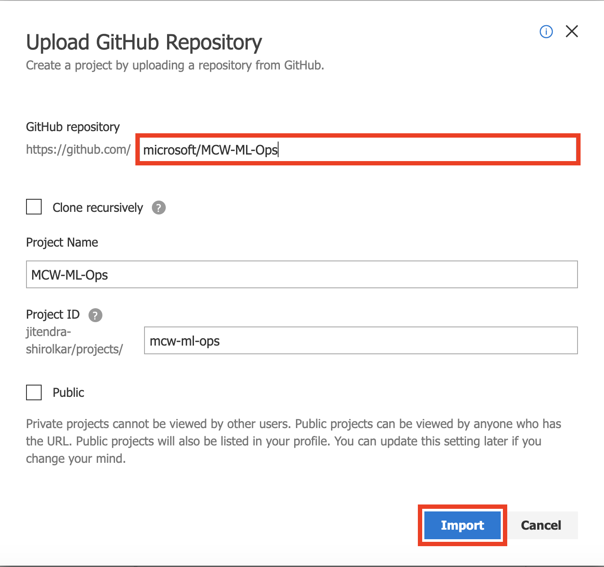

<div class="MCWHeader1">
MLOps
</div>

<div class="MCWHeader2">
Before the hands-on lab setup guide
</div>

<div class="MCWHeader3">
June 2019
</div>


Information in this document, including URL and other Internet Web site references, is subject to change without notice. Unless otherwise noted, the example companies, organizations, products, domain names, e-mail addresses, logos, people, places, and events depicted herein are fictitious, and no association with any real company, organization, product, domain name, e-mail address, logo, person, place or event is intended or should be inferred. Complying with all applicable copyright laws is the responsibility of the user. Without limiting the rights under copyright, no part of this document may be reproduced, stored in or introduced into a retrieval system, or transmitted in any form or by any means (electronic, mechanical, photocopying, recording, or otherwise), or for any purpose, without the express written permission of Microsoft Corporation.

Microsoft may have patents, patent applications, trademarks, copyrights, or other intellectual property rights covering subject matter in this document. Except as expressly provided in any written license agreement from Microsoft, the furnishing of this document does not give you any license to these patents, trademarks, copyrights, or other intellectual property.

The names of manufacturers, products, or URLs are provided for informational purposes only and Microsoft makes no representations and warranties, either expressed, implied, or statutory, regarding these manufacturers or the use of the products with any Microsoft technologies. The inclusion of a manufacturer or product does not imply endorsement of Microsoft of the manufacturer or product. Links may be provided to third party sites. Such sites are not under the control of Microsoft and Microsoft is not responsible for the contents of any linked site or any link contained in a linked site, or any changes or updates to such sites. Microsoft is not responsible for webcasting or any other form of transmission received from any linked site. Microsoft is providing these links to you only as a convenience, and the inclusion of any link does not imply endorsement of Microsoft of the site or the products contained therein.

© 2019 Microsoft Corporation. All rights reserved.

Microsoft and the trademarks listed at <https://www.microsoft.com/en-us/legal/intellectualproperty/Trademarks/Usage/General.aspx> are trademarks of the Microsoft group of companies. All other trademarks are property of their respective owners.

**Contents**

<!-- TOC -->

- [MLOps before the hands-on lab setup guide](#insert-workshop-name-here-before-the-hands-on-lab-setup-guide)
  - [Requirements](#Requirements)
  - [Before the hands-on lab](#Before-the-hands-on-lab)
    - [Task 1: Setup an Azure Notebooks account](#Task-1-Setup-an-Azure-Notebooks-account)
    - [Task 2: Setup an Azure Notebooks project](#Task-2-Setup-an-Azure-Notebooks-project)
    - [Task 3: Start the Notebook server](#Task-2-Start-the-Notebook-server)

<!-- /TOC -->

# MLOps before the hands-on lab setup guide 

## Requirements

1. Azure subscription. You will need a valid and active Azure account to complete the quickstarts. If you do not have one, you can sign up for a [free trial](https://azure.microsoft.com/en-us/free/).

    **Note**

    The Microsoft Azure subscription must be pay-as-you-go or MSDN. 

    Trial subscriptions will not work. You will run into issues with Azure resource quota limits. 

    Subscriptions with access limited to a single resource group will not work. You will need the ability to deploy multiple resource groups.

2. Azure DevOps subscription. You will need a valid and active Azure DevOps account to complete the quickstarts. If you do not have one, you can sign up for a [free account](https://azure.microsoft.com/en-us/services/devops/). Note that you will need privileges to create projects on the DevOps account. Also, you need priveleges to create Service Principal in the tenet. This translates to `Ensure that the user has 'Owner' or 'User Access Administrator' permissions on the Subscription`.

3. Azure Notebooks. You will need an Azure Notebooks project to import the quickstart notebooks into. See instructions below on how to prepare your Azure Notebooks environment.

4. Azure Machine Learning service workspace. The workspace is created during Exercise 1 from the hands-on lab.

    **Note**: Make sure you execute successfully all steps related to the Azure Machine Learning service workspace setup in Exercise 1. A correctly set up workspace is needed by all the other exercises.


## Before the hands-on lab

Duration: 5 minutes

At a high level, here are the setup tasks you will need to perform to prepare your Azure Notebooks Environment (the detailed instructions follow):

1. Setup an Azure Notebooks account.

2. Setup Azure Notebooks Project

3. Start the Notebook Server


### Task 1: Setup an Azure Notebooks account

1. In your browser, navigate to [https://notebooks.azure.com](https://notebooks.azure.com).

2. Select Sign In from the top, right corner and sign in using your Microsoft Account credentials. After a successful login, you will have implicitly created the account and are ready to continue.

### Task 2: Setup an Azure Notebooks project

1. Log in to Azure Notebooks.

2. Navigate to **My Projects** page

3. Select **Upload GitHub Repo**.

4. In the Upload GitHub Repository dialog, for the GitHub repository provide ```solliancenet/mcw-mlops```, and select **Import**. Allow the import a few moments to complete, the dialog will dismiss once the import has completed.

   

5. Once the import is complete, a new project named ```mcw-mlops``` is available in your account. All the notebooks mentioned in the hands-on lab are available in the following location: ```\Hands-on Lab\notebooks```.

### Task 3: Start the Notebook server

1. Navigate to your project: ```mcw-mlops```

2. Start your Notebook server on **Free Compute** by selecting the **Play** icon in the toolbar as shown:

   

3. It should open the **Jupyter Notebooks** interface.

